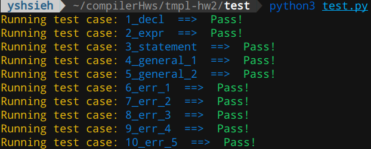
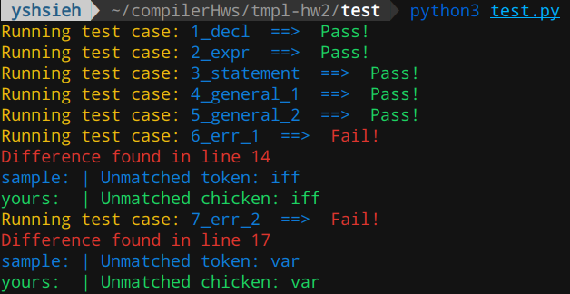

# Project Assignment 2 - Syntactic Definitions

|:warning: **Do not plagiarize my work or you will be graded ZERO !**|
|-|

**Introduction to Compiler Design by Prof. Yi-Ping You**

Due Date: **23:59, November 13, 2019**

Your assignment is to write an **LALR(1)** parser for the **`P`** language. You will have to write the grammar and create a parser using `yacc`. 

Your programming assignments are based around this division and later assignments will use the parts of the system you have built in the earlier assignments; that is, in the third and fourth assignments you will implement the semantic definition based on first and second assignments, and in the last assignment you will generate RISC-V assembly code by augmenting your yacc parser.

The grammer is subject to modification as the semester progresses. You should make sure the program you write is well-structured and easily changed.

---

**Table of Contents**
- [Project Assignment 2 - Syntactic Definitions](#project-assignment-2---syntactic-definitions)
  - [Assignment](#assignment)
  - [Syntactic Definitions](#syntactic-definitions)
    - [Program Units](#program-units)
    - [Data Types and Declarations](#data-types-and-declarations)
    - [Statements](#statements)
  - [Implementation Notes](#implementation-notes)
  - [What Should Your Parser Do?](#what-should-your-parser-do)
  - [Project Structure](#project-structure)
  - [Submitting the Assignment](#submitting-the-assignment)

---

## Assignment

You must create an **LALR(1)** grammar using `yacc`. You need to write the grammar following the syntactic in the following sections. Once the LALR(1) grammar is defined you can then execute `yacc` to produce a C program called `"y.tab.c"`, which contains the parsing function `yyparse()`. You must supply a **main** function to invoke `yyparse()`. The parsing function `yyparse()` calls `yylex()`. You will have to revise your scanner function `yylex()`.

## Syntactic Definitions

### Program Units

The two program units are the *program* and the *functions*.

 - #### Program

    A program has the form:

        identifier; 
        <zero or more variable and constant declaration>
        <zero or more function declaration>
        <one compound statement>
        end identifier

    A program has no arguments, and hence no parentheses are present in the header. There are two types of variables in a program:

    - **global variables:**   declared after the identifier but before the compound statement
    - **local variables:**   declared inside the compound statement and functions 

 - #### Function

    A function declaration has the following form:

        identifier (<zero or more formal arguments>): scalar_type;
        <one compound statement>
        end identifier

    Parentheses are required even if no arguments are declared. No functions may be declared inside a function.

    The formal arguments are declared in a formal argument section, which is a list of declaration separated by semicolons. Each declaration has the form
    
        identifier_list: type

    where identifier_list is a list of identifier separated by comma:

        identifier, identifier, ..., identifier

    At least one identifier must appear before each colon, which is followed by exactly one type(include array) specification. Note that if arrays are to be passed as arguments, they must be fully declared. All arguments are passed by values.

    Functions may return one value or no value at all. Consequently, the return value declaration is either a type name or is empty. If no return value is declared, there is no colon before the terminating semicolon. A function that returns no value can be called a `"procedure"`. For example, following are valid function declaration headers:

        func1(x, y: integer; z: string): boolean;
        func2(a: boolean): string;
        func3();        // procedure
        func4(b: real); // procedure
        func5(): integer;		

### Data Types and Declarations

 - #### Variable

    The four predefined scalar data types are `integer`, `real`, `string`, and `boolean`. The only structured type is the `array`. A variable declaration has the form:

        var identifier_list: scalar_type;

    or

        var identifier_list: array integer_constant to integer_constant of type;

    where integer_constant should be a non-negitive integer constant (i.e., zero or a postive interger).

 - #### Constant

    A constant declaration has the form:

        var identifier_list: literal_constant;

    where literal_constant is a constant of the proper type (e.g. an integer literal, string literal, true, or false).

    > Note that assignments to constants are not allowed and constants can not be declared in terms of other named constants. Variables may not be initialized in declarations.

### Statements

There are seven distinct types of statements: compound, simple, conditional, while, for, return, and procedure call.

 - #### compound

    A compound statement consists of a block of statements delimited by the keywords `begin` and `end`, and an optional variable and constant declaration section:

        begin
        <zero or more variable and constant declaration>
        <zero or more statements>
        end

    Note that declarations inside a compound statement are local to the statements in the block and no longer exist after the block is exited.

 - #### simple

    The simple statement has the form:

        variable_reference := expression;

    or

        print variable_reference; or print expression;

    or

        read variable_reference;

    A *variable_reference* can be simply an *identifier* or an *array_reference* in the form of

        identifier [expression] [expression] [...]

 - #### expressions

    Arithmetic expressions are written in infix notation, using the following operators with the precedence:

    ||Operator|
    |:-:|:-:|
    |negative|**`-`**|
    |addition|**`+`**|
    |subtraction|**`-`**|
    |multiplication|**`*`**|
    |division| **`/`**, **`mod`**|
    |relational| **`<`**, **`<=`**, **`<>`**, **`>=`**, **`>`**, **`=`** |
    |logical|**`and`**, **`or`**, **`not`**|

    Note that:

    1. The token **"-"** can be either the **binary subtraction** operator, or the **unary negation** operator. Associativity is the left. Parentheses may be used to group subexpressions to dictate a different precedence. Valid components of an expression include **literal constants**, **variable names**, **function invocations**, and **array reference** 

    2. The part of semantic checking will be handled in the 4th assignment. In this assignment, you don't need  to check semantic errors like **"a := 3 + true;"**. Just take care of syntactic errors!

    **array reference**

        identifier [expression] [expression] [...]

    **function invocation**

        identifier (<expression separated by zero or more comma>)

 - #### conditional

    The conditional statement may appear in two forms:

        if expression then
        <zero or more statements>
        else
        <zero or more statements>
        end if

    or

        if exprression then <zero or more statements> end if

 - #### while

    The while statement has the form:

        while expression do
        <zero or more statements>
        end do

 - #### for

    The for statement has the form:

        for identifier := integer_constant to integer_constant do
        <zero or more statements>
        end do

 - #### return

    The return statement has the form:

        return expression ;

 - #### function invocation

    A procedure is a function that has no return value. A procedure call is then an invocation of such a function. It has the following form:

        identifier (<expressions separated by zero or more comma>) ;

## Implementation Notes

Since `yyparse()` doesn't do its own lexical analysis. It needs to call the `yylex()` every time it wants to obtain a token from the input. Therefore, you should modify the scanner to pass token information to `yyparse()`. For example, when the scanner recognizes an identifier, the action should be revised as

    ([A-Za-z])([A-Za-z0-9])*		{ tokenString("id", yytext); return ID; }
    /* Note that the symbol `ID` is defined by the yacc parser */

## What Should Your Parser Do?

The parser should list information according to **Opt_S** and **Opt_T** options (the same as Project 1).  If the input file is syntactically correct, print 

    |--------------------------------|
    |  There is no syntactic error!  |
    |--------------------------------|

Once the parser encounters a syntactic error, print an error message in the form of

    |--------------------------------------------------------------------------
    | Error found in Line #[ line number where the error occurs ]: [ source code of that line ]
    |
    | Unmatched token: [ the token that is not recognized ] 
    |-------------------------------------------------------------------------- 

## Project Structure

+ README.md
+ /src
    + Makefile
    + **`scanner.l`**
    + **`parser.y`**
    + **`error.h`**
+ /report
    + **`READMD.md`**

In this project, you have to modify `src/scanner.l`, extend `src/parser.y` and write your report in `report/README.md`.

 > **Note**: You can extend your `lex.l` from HW1 instead of using `scanner.l` we provided. However, you need to make sure your `lex.l` works correctly and remember to modify `Makefile` that `scanner.l` should be replaced by `lex.l`.

The report should at least describe what changes you have to make to your scanner since the previous version you turned in, the abilities of your parser.

If you want to preview your report in GitHub style markdown before pushing to GitHub, [grip](https://github.com/joeyespo/grip) might be the tool you need.

## Build and Execute

+ Build: `cd src && make`
+ Execute: `./parser [input file]`
+ Test: `cd test && python3 test.py`

### Build project

TA would use `src/Makefile` to build your project by simply typing `make clean && make`. You don't need to modify this file, but if you do, it is **your responsibility** to make sure this makefile have at least the same make targets we provided to you.

### Test your parser

We provide some basic tests in the `test` folder. Simply `cd` to `test` folder and type `python3 test.py` to test your parser. You can also type `python3 test.py --help` to know what arguments you can set.

The objective we provide sample test cases is making sure your parser outputs in correct format and parses program correctly. You will get at least **60 pts** if you pass all the test cases.

> **Disclaimer**: To receive full grade in this assignment, passing sample test cases is necessary but not sufficient. You should create more test cases in order to make sure your parser handles all `Syntactic Definitions` in this assignment correctly.

Please using `student_` as the prefix of your own tests to prevent TAs from overriding your files. For example: `student_identifier_test`.

If you pass all test cases, you will get:

You will get the following output messages if your parser outputs a wrong format (A blue line with a prefix `sample:` shows a sample solution, and a green line with a prefix `yours:` is your output):

## Submitting the Assignment
 
You should push all your commits to the designated repository (hw2-\<Name of your GitHub account\>) under the compiler-f19 GitHub organization by the deadline (given in the very beginning of this assignment description). At any point, you may save your work and push the repository. You **must** commit your final version to the **master branch**, and we will grade the commit which is **last pushed** on your master branch. The **push time** of that commit will be your submission time, so you **should not** push any commits to the master branch after the deadline if you have finished your assignment; otherwise, you will get a late penalty.

Note that the penalty for late homework is **15% per day** (weekends count as 1 day). Late homework will not be accepted after sample codes have been posted.

In addition, homework assignments **must be individual work**. If I detect what I consider to be intentional plagiarism in any assignment, the assignment will receive reduced or, usually, **zero credit**.
